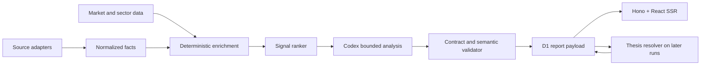

# Pricing Intelligence V2 Design

## Product direction

Stock Daily becomes a selective CN/US expectation-gap and transmission brief. The
system treats verified facts as inputs, deterministic code as the owner of scores
and arithmetic, and Codex as the owner of bounded synthesis. Every core thesis is
stored with a future checkpoint so the product can show what happened after
publication.

## Design specification

- Purpose: answer what changed versus a baseline, how markets are likely to absorb
  it, and what would prove the view wrong in five minutes.
- Aesthetic: editorial/magazine with research-terminal precision.
- Palette: paper `#f5f0e6`, ink `#132621`, brand `#123b34`, coral `#c85a43`,
  verification green `#16785f`.
- Typography: Newsreader Variable and Noto Serif SC Variable for editorial display;
  Noto Sans SC Variable for data and controls.
- Layout: asymmetric desktop board with a dominant thesis column and a compact
  verification rail; linear mobile order of events, thesis, signals and ledger.
  Existing brand tokens and self-hosted fonts are retained.

## Architecture



Cloudflare remains the SSR and storage layer. Collection, enrichment, Codex analysis,
validation and writes remain local. No model-generated number is trusted without an
input fact or deterministic calculation.

## Data contracts

### Source attribution

```ts
type SourceTier = "first_party" | "wire" | "secondary";

interface EvidenceSource {
  url: string;
  label: string;
  tier: SourceTier;
  observedAt?: string;
}
```

The existing `source` and `sourceLabel` fields remain for backward compatibility.
New reports also store `evidenceSource`.

### Baseline and reaction

```ts
type BaselineKind = "consensus" | "prior" | "guidance" | "policy" | "none";

interface SignalMetric {
  label: string;
  actual?: number;
  expected?: number;
  prior?: number;
  unit: string;
  surprise?: number;
  surpriseUnit?: string;
  source: EvidenceSource;
}

interface MarketReaction {
  instrument: string;
  change: string;
  window: string;
  asOf: string;
  source: EvidenceSource;
}
```

Only deterministic code calculates `surprise`.

### Analysis and verification

```ts
type SignalHorizon = "intraday" | "1-5d" | "1-4w";
type SignalConfidence = "low" | "medium" | "high";
type ThesisStatus =
  | "pending"
  | "confirmed"
  | "partial"
  | "invalidated"
  | "inconclusive";

interface TransmissionStep {
  order: 1 | 2 | 3;
  from: string;
  to: string;
  mechanism: string;
  conditional: boolean;
}

interface SignalExposure {
  name: string;
  ticker?: string;
  exchange?: string;
  direction: "positive" | "negative" | "mixed";
  basis: string;
}

interface VerificationCheckpoint {
  metric: string;
  dueAt: string;
  confirmIf: string;
  invalidateIf: string;
  status: ThesisStatus;
  observation?: string;
  resultSource?: EvidenceSource;
  verifiedAt?: string;
}

interface PricingSignal {
  version: 2;
  rank: number;
  role: "core" | "supporting";
  score: number;
  scoreReason: string;
  thesis: string;
  baselineKind: BaselineKind;
  metrics: SignalMetric[];
  reactions: MarketReaction[];
  transmission: TransmissionStep[];
  exposures: SignalExposure[];
  horizon: SignalHorizon;
  confidence: SignalConfidence;
  checkpoint: VerificationCheckpoint;
}
```

`Story` receives an optional `signal` field. Existing reports continue to use
`StoryInsight`; V2 reports require both the legacy summary fields and `signal`.

### Thesis ledger persistence

The first release embeds checkpoints in report JSON and resolves them while
collecting recent reports. This avoids a new public CRUD surface and keeps each
published thesis immutable except for its resolution fields. If the ledger grows
beyond the existing compact-report storage target, a later migration may normalize
it into a separate table.

## Deterministic selection

Collection remains broad enough to find candidates. A new ranker computes:

```text
score =
  importance * 20
  + source tier (first party 16, wire 10, secondary 4)
  + numeric baseline 10
  + attributable reaction 8
  + verified listed entity 6
  + cross-market relevance 4
  - duplicate topic penalty 12
```

The exact weights are tested and visible in code. Reports keep the highest-scoring
three qualified stories per market as core and at most two as supporting. The
selector preserves `sourceIndex` for traceability but display rank is independent.

## Source and entity resolution

- Feed items may carry `canonicalSource` when a first-party link is discovered.
- Known listed entities live in a deterministic alias map with ticker and exchange.
- The validator requires every explicitly named listed entity to appear in
  `exposures`; it rejects unsupported model-added entities.
- Aggregator facts without a recoverable primary URL remain allowed only with a
  visible secondary tier and a lower selection score.

## Analysis ownership

Codex receives enriched candidates and emits only:

- thesis and score reason wording;
- transmission steps;
- exposure basis;
- horizon and confidence;
- confirm and invalidate conditions;
- bilingual translations.

Codex does not choose actual/expected/prior numbers, calculate surprise, resolve
tickers, classify source tier or infer market-price changes.

Validation rejects:

- missing core checkpoint fields;
- causal chains with no story-specific noun from facts, metrics or exposures;
- unsupported tickers;
- bare generic mechanism text;
- fake precision in confidence;
- direct investment instructions.

## Weekly-event integration

Weekly events add optional structured metrics. Daily collection matches verified
official releases to events, writes actual and surprise, and retains the existing
same-authority result rule. The event tiles stay at the top of the pricing board.

## SSR information architecture

`PricingBoard` replaces the presentation role of `HotspotBoard` while retaining the
single-component boundary requested by the user:

1. weekly events with expected/prior/actual;
2. today’s pricing thesis;
3. core signals ordered by deterministic rank;
4. optional supporting signals;
5. recent thesis ledger.

Each signal summary shows the thesis, expectation gap, reaction and horizon. Expanded
content shows observed facts, causal steps, exposures, checkpoint and evidence.
The current raw `0–100` heat score is not a headline value; visible heat rows lead
with return and streak, with the score available only as a secondary intensity
measure.

## Compatibility and migration

- Readers normalize missing `signal` and `evidenceSource` fields.
- A new migration upgrades current embedded seed data but does not rewrite historic
  D1 payloads destructively.
- Current daily and weekly reports are regenerated after deployment.
- API response shapes remain additive.

## Security and compliance

- Source URLs are validated as HTTP(S).
- No credentials or raw article bodies are persisted.
- Facts and inference remain visually distinct.
- No recommendation, allocation or target-price language is accepted.
- Consensus values are displayed only when their provider permits storage and
  display; official/prior/guidance baselines remain the fallback.

## Test strategy

- Unit: source tier, entity aliases, score order, cap/floor rules, surprise math,
  generic-text rejection and checkpoint resolution.
- Contract: V2 daily/weekly payload validation and legacy compatibility.
- SSR: one pricing board, events-before-signals, deterministic order, complete
  V2 labels and no duplicate overview.
- Browser: desktop and 390-pixel layout, detail interaction, keyboard focus, dark
  theme and both languages.
- Production: API fields, real current signals, current weekly metrics, SSR content,
  no overflow and no console errors.
